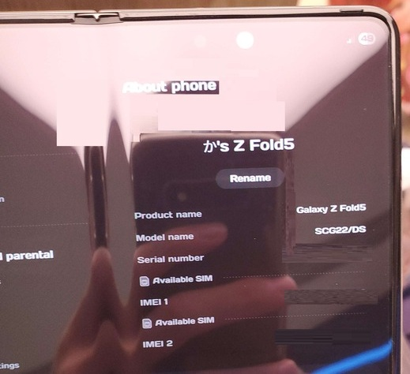
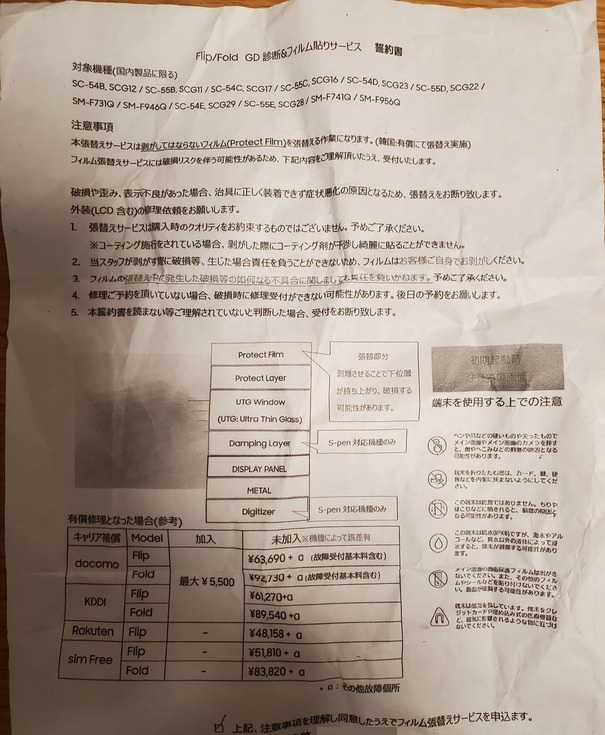

# samsung-galaxy-repair-service-bypass
Galaxy Harajuku / Galaxy Studio Osaka にてフィルム貼り替えの際、海外版でも貼り替えてもらえるようにしよう
## 概要
Galaxy Harajuku / Galaxy Studio Osaka では日本で発売されたSamsung端末のフィルムを **無償で** 貼り替えてくれます (しかも専用機材があるからめっちゃきれに貼ってもらえる)  
フィルム代と時間と労力を節約できる神サービス (特にFold端末のフィルムは1枚2500円とかなので) だから積極的に使っていきましょう  
## Samsung公式にもどっかのブログにも書いてない注意事項
- **原則 日本版端末 のみ**  
  日本で発売されたモデル != 日本で **も** 発売されたモデル -> True
    
  Z Fold 5は日本でも発売されたけど、対象になる端末は  
  SCG22 (KDDI) / SO-55D (NTT) / SM-F956Q (Samsung Japan) の3モデルのみ！  
  今回僕が貼り替えをお願いした SM-F956B/DS (Global 2-nano-SIM) は対象外でした  
  どこかにそう書いてあったのではなく、1回目にGalaxy Harajukuへ訪問した際に設定のAbout phoneを見られてから「日本版以外はハードウェアが同じでもこのショップで保証ができないので受け付けられません」とハッキリ言われました

- **対象端末がキモい**  
  発売約5～6年ほどの端末が対象ですが、S20シリーズだと S20 Plus だけ対象で、S20 と S20 Ultra は日本版でも対象外になっていました (NTTモデルのみ)  
  ショップの店員に確認しましたが、間違いないそうです  
  それ以前の発売日になっている端末はすべて対象外です  

- **端末言語は日本語にするべき**  
  端末言語だけで海外版判定してくる~~頭の悪い~~店員が一定数いるので、余計なトラブルを避けるために貼り替えサービスを受ける間だけでも日本語に設定しておきましょう

- **ハードウェア改造済み端末は対象外**  
  後述しますが、僕の SM-F956B/DS はバックパネルが透明に改造されているので対象外のようです  
  ちなみにフィルム貼り替えサービスが終わった後に気づかれて指摘されたので、バックパネルは基本的に見られていません、その代わりメインディスプレイに傷や表示不良がないかはめちゃくちゃ見られます  
  Galaxy Studio Osakaではなぜか電池の状態をADBで確認されましたが、Harajukuではディスプレイしか見られませんでした  

- **契約情報は見られない**  
  イオシスで買ってそのまま渡したFold 4でも貼り替えてもらえました  
  あとすでにフィルムが剝がれている状態でも問題なく受け付けてもらえます  

  
以上の点に注意してストアへ行きましょう！

## 海外版を持ってる人がやること (要root!!!)
このリポジトリに置いてあるMagiskモジュールをダウンロードしたら、```system.prop``` にある ```ro.product.model=SCG22``` の ```SCG22``` の部分を置き換えたい日本版の端末のモデル名に変えてインストールします  
これにより /system/system.prop の行がモジュールによって上書きされ、設定のAbout phoneに表示されるModel nameが変更されます  
手動で書き換えはできないと思います (Androidのセキュリティーポリシーによって) [Magic Overlayfs](https://github.com/agreenbhm/magic_overlayfs) を使用してもsystem.propの内容は編集できませんでした  
- **注意**  
  2-nano-SIMモデルの端末の末尾につく /DS (SM-G970F/DSとかSM-F956B/DS) の表記は消えません！  
  そのため2-nano-SIMで偽装すると 日本版モデル名/DS という存在しないモデル名 (日本版に2-nano-SIMモデルはナシ) ができあがります (僕はSCG22/DSになった)  
  でもショップ店員ってそんなGeekじゃないからバレないです


### もちろんKnoxは0x1トリップするから必要な人は気をつける
## Samsungストア体験記
**1日目**:   
原宿SamsungにFold 5 SM-F956B/DSをそのまま持っていき、店員にAbout phoneを見られると、どこで買ったかを聞かれる  
グローバルモデルと正直に言ったら弾かれました  
10秒で終わったので友達はきょとんとしていた  

------------------------------------------------------------------------

**2日目**:   
わんちゃんrootあれば端末モデル名変えられるんじゃね？と思ってすでにrootedのFold 5でモジュールを作った  

###### しっかり SCG22/DS になってしまっている...  

また原宿まで行ってストアを訪問した  
受け付けのおねえさんに見せたら0.3秒くらいでau版ですね～と言われた、友達はわらってた  

そのまま地下にある修理室に連れていかれ、同意書にサインした  
  
###### あたりまえだけど対象端末には日本版のモデル名しか書かれていない
###### 外装(LCD 含む)の修理依頼をお願いします と書いてあるが、FoldでLiquid Crystal Displayを採用してる端末は存在しない (Sでもない)、公式がこれでいいのだろうか
基本的にメインディスプレイ以外見られていないので、バックパネルを改造してても通る可能性が高い  
ケースは取り外すよう促されるので、先にとっておいた方がいい  
また、電源も切りますね～と言われるのでrootedかつFirefds Kitを導入している人は、最悪の可能性を考えてバレないために自分で電源を落とそう  
  
###### Magiskモジュールをアンインストールするときれいさっぱり戻る、systemlessだから汚れない
施工は10分くらいで終わる  
返却されるときに端末を勝手に起動されるので、Bootloader Unlockedなのは完全にバレてるだろう (でもBLUに関しては何も言われなかったからもしかしたらそんな知識がないかも)  
バックパネルについてはここで指摘された、今後はサポートできませんと言われました  
https://x.com/TakeTakaAway/status/1953370084132442117  _バックパネルの状態のツイート_  
ともあれ、もう施工が終わっているので改造バレはどうでもいい、テキトーに流して去ろう、さすがにフィルム剥がしますねー！wはない  
その後は原宿のSamsungストアにあるツアーで遊んでから帰りました、楽しかった (ただツアーはどうみても2人以上が想定されているから友達を連れてこよう！！！)  
https://x.com/TakeTakaAway/status/1956988143103848827 _ツイートしたらジュースがもらえたやつ_  

------------------------------------------------------------------------

**3日目**:   
大阪なんばにあるGalaxy Studio Osakaにも、名古屋で唐突に買ってしまった Fold 4 のフィルムを貼りに行ってきた (純正フィルムがないだけでジャンク扱い、たったの59800円...衝動買い)  
NTTのモデルなのでイオシスの袋からそのまま出して同意書にサインして10分待ったら終わった、大阪Samsungはビルの1ブースみたいな感じで存在しててツアーなどは一切ない、なんならフィルム貼り以外の修理もできないらしい  
特にすることがないのでそのままお店を後にした  

## あとなんか
まず、行けるなら絶対Galaxy Harajukuの方が楽しい  
Samsung好きそうな友達を誘っていっしょに展示品を眺めよう、眺めてたら店員さんが一生懸命Galaxyの機能を教えてくれます  
無料かつ予約もいらないので、イオシスかなんかでフィルムなしジャンク（笑）を安く拾ってストアで貼ってもらえばふつうに買った値段より2万円ほど高く売れるようになる  
仲間にするもよし、転売で臨時収入もよし、いいことしかないので見つけたら脳死で購入したらいい  
ストアにいる人は特段エンジニアとかではないのでrootedの人も堂々としていればOK、この備忘録が誰かの役に立てばいいな  

## コンタクト
Discordユーザー名 -> ~~.taka.~~ _.taka  
Discordサーバー -> https://discord.gg/g4UE3kQbmS  
